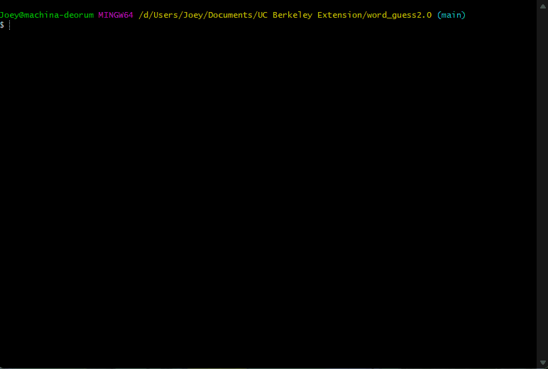

# **Word Guess 2.0**
---

## **Description**
---
Word Guess 2.0!!  With even more than just one word to guess at a time! This iteration of word guess is fully available for play through your terminal or console!

## **Installation**
---
To ensure this app works correctly, make sure you download the main directory and use the `npm install` command to properly install all the dependencies.

## **Usage**
---
To start playing Word Guess 2.0 you will need to use the `npm start` command in your console/terminal while in the directory where the index.js is stored.

In the above animation you can see how the gameplay works with user input. You have 10 incorrect attempts available. Correct guesses do not count towards it. If you complete a word you will be given another word to complete, however if you do not complete the given word you will be given an option to stop playing.

## **Credits**
---
This app was made as a collaboration between [cmwschroeder](https://github.com/cmwschroeder) and [coderbennett](https://github.com/coderbennett). 

## **Technologies**
---
The technologies used in this app include [Node.js](https://nodejs.org/en/), [inquirer](https://www.npmjs.com/package/inquirere), [jest](https://www.npmjs.com/package/jest), and [chalk](https://www.npmjs.com/package/chalk).

## **License**
---
This project is made available with the MIT license. To view the license view the linked [LICENSE](LICENSE.txt) file.